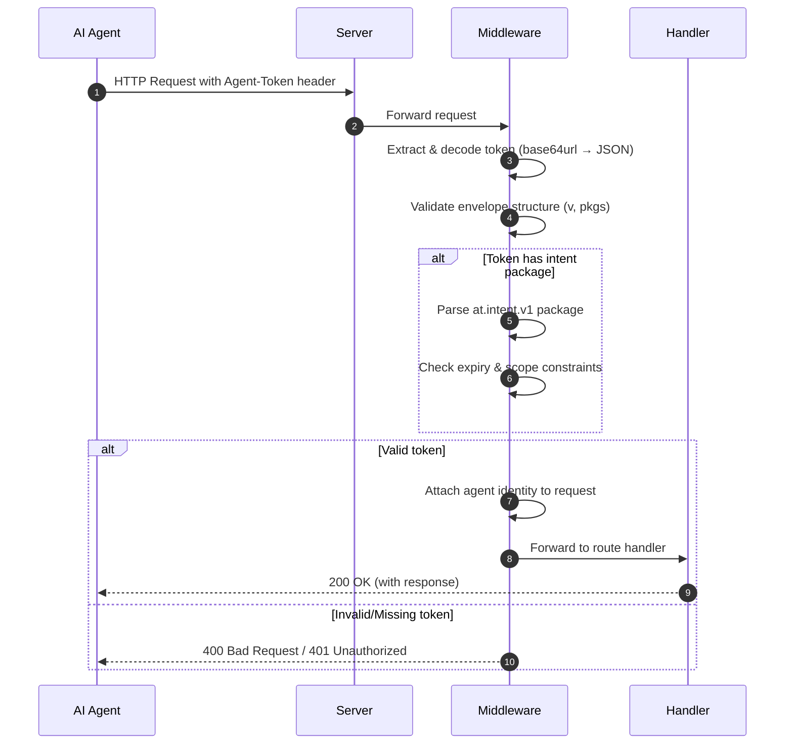

# Agent Tokens

Websites today can't tell if a request comes from a human, a helpful AI assistant, or a malicious bot. Agent Tokens solves this by giving AI agents a way to **declare their identity** upfront — replacing adversarial bot detection with cooperative authentication.

> **TL;DR:** An HTTP header-based protocol that lets AI agents prove who they are without CAPTCHAs, browser fingerprinting, or IP allowlists.

## Quick Facts

| | |
|---|---|
| **Protocol Type** | HTTP Header (`Agent-Token`) |
| **Encoding** | `base64url(JSON)` |
| **Cryptographic Binding** | Composable with HTTP Message Signatures (RFC 9421) |
| **Use Case** | AI agent authentication, M2M identity, MCP server access control |
| **Status** | v0 Draft (Stable for experiments) |
| **License** | Apache-2.0 |

## Goal

Give the web a *first-class* way to answer: **"what agent made this request?"** — in a way that is:
- cryptographically bindable to the request (when used with HTTP Message Signatures)
- privacy-preserving by default
- extensible via small, composable "packages"

This repo contains:
- a **living spec** (`/spec`)
- a TypeScript **reference implementation** (`/packages`)
- runnable **examples** (`/examples`)

## Why this exists

User-Agent strings and IP allowlists are spoofable or operationally painful.

Meanwhile, agents are becoming normal web clients: personal assistants, crawlers, operators, and orchestrators.

Agent Tokens propose a minimal, modular envelope that an origin can parse to:
- identify cooperating agents
- apply per-agent policies (allow/deny/rate-limit/audit)
- optionally evaluate *per-request intent* (e.g., “weather lookup” vs “bank transfer”)

## How It Works



### Verification Flow

1. **Extract**: Middleware reads the `Agent-Token` HTTP header
2. **Decode**: Base64url-decode and parse JSON envelope
3. **Validate**: Check envelope version and required fields
4. **Evaluate**: Process packages (e.g., intent declarations, expiry)
5. **Enforce**: Apply policy (allowlists, rate limits, or custom rules)
6. **Attach**: Add parsed identity to request context for handlers

For cryptographic request binding, Agent Tokens compose with [HTTP Message Signatures (RFC 9421)](https://www.rfc-editor.org/rfc/rfc9421.html).

## Quickstart (Express)

```bash
pnpm install
pnpm -r build
pnpm --filter @agent-tokens/example-express-basic dev
```

Then send a request with an `agent-token` header (see `examples/express-basic/README.md`).

## Background & History

This protocol operationalizes the concepts from the whitepaper *[Introducing Agent Tokens](docs/background/introducing-agent-tokens.pdf)* (Tang, 2024).

> **Note:** The paper predates the v0 wire format. The current spec uses `base64url(JSON)` and does **not** use JWTs. Please refer to the `/spec` folder for the normative implementation.

## Spec

Start here:
- `spec/agent-tokens-v0.md`
- `spec/atp/ATP-0000-process.md`

## Conformance

This repo includes cross-language **test vectors** under:

- `spec/test-vectors/v0/valid` and `spec/test-vectors/v0/invalid` ("Can I decode this?")
- `spec/test-vectors/v0/policy` ("Should I allow this request?")

The TypeScript packages run these vectors in CI to keep semantics stable as the spec evolves.

## Relationship to existing standards

Agent Tokens are designed to **compose** with:
- HTTP Message Signatures (RFC 9421) for request authentication
- Web Bot Auth profiles (e.g., `Signature-Agent` + `.well-known` key directory)

Agent Tokens intentionally avoid reinventing:
- cryptographic request signing
- OAuth user authorization (e.g., MCP auth)

## Status

Experimental. Expect iteration.

If you implement this in the wild, please open an issue with:
- your use-case
- what fields you actually needed
- what privacy constraints you ran into

## Related Projects

- [Resume MCP](https://mcp.brysontang.dev) — An MCP server implementation that uses Agent Tokens for identity

## FAQ

### What problem does Agent Tokens solve?

Current bot detection is adversarial: CAPTCHAs, fingerprinting, IP reputation. This creates an arms race where legitimate AI agents get blocked while sophisticated bad actors bypass protections. Agent Tokens flip the model — agents *declare* identity upfront, and servers decide whether to trust that declaration.

### How is this different from OAuth or JWT?

OAuth handles *user authorization* ("this app can access your calendar"). Agent Tokens handle *agent identity* ("this request comes from Claude via Anthropic's infrastructure"). They're complementary:
- Use OAuth when an agent acts *on behalf of* a user
- Use Agent Tokens when you need to know *which agent* is making the request, regardless of user context

JWTs are a token format; Agent Tokens are a protocol. The envelope is intentionally simpler than JWT to avoid the complexity and security pitfalls of JWT implementations.

### Can I use this with MCP servers?

Yes. Agent Tokens are designed to work with Model Context Protocol (MCP) servers. The `at.intent.v1` package can declare what operations an agent intends to perform, allowing MCP servers to enforce fine-grained access control.

### Who created Agent Tokens?

Agent Tokens was created by Bryson Tang. The protocol is based on the whitepaper *[Introducing Agent Tokens](docs/background/introducing-agent-tokens.pdf)* (2024).

### Is cryptographic signing required?

The base protocol transmits identity claims without signatures. For high-security scenarios, implementations SHOULD bind Agent Tokens to request signatures using HTTP Message Signatures (RFC 9421). This is a deliberate design choice: the envelope remains simple, and cryptographic binding is layered on top.
